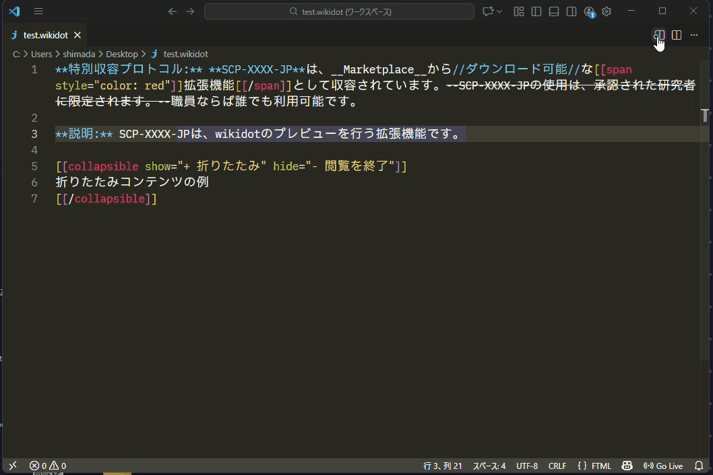

# Wikidot Preview

Wikidot Preview is a VS Code extension that provides Wikidot syntax highlighting and a local preview for Wikidot content. It is a fork of the [FTML/Wikidot Workshop](https://github.com/Zokhoi/vscode-ftml).

This project narrows the feature set compared to the original FTML/Wikidot Workshop. It does not provide a preview that depends on Wikidot's server-side features, and it does not offer login, fetch, or push functionality to Wikidot.

## 概要(japanese)

Wikidotのシンタックスハイライト、プレビュー機能を提供するVS Code拡張です。[FTML/Wikidot Workshop](https://github.com/Zokhoi/vscode-ftml)のForkです。

本家FTML/Wikidot Workshopから機能を絞っています。プレビュー機能は@wdprlib/parser, @wdprlib/renderを使用しています。また、Wikidotへのログイン/フェッチ/プッシュ機能は提供しません。



## include
include構文に対応しています。
コロンで区切られた最後のセクションの名前でファイルを用意してください。
たとえば [[include :site-name:component:test]] であれば、 `test.wd` を同階層に用意することで、プレビュー時に自動で読み込まれます。
この仕様は暫定的なものであり、予告なく変更になる可能性があります。

## Development

```bash
pnpm run compile
```

## References

* [FTML Blocks documentation](https://github.com/scpwiki/wikijump/blob/develop/ftml/docs/Blocks.md)
* [FTML file specficiation](https://gist.github.com/Zokhoi/06dbc890a4f2fab3eadcd7d2ed0d8698)

## License

- This project is licensed under the GNU Affero General Public License v3 or later. See [LICENSE.md](LICENSE.md) for the full text.
- This repository is a modified version of another project; see [CHANGES.md](CHANGES.md) for attribution and a summary of modifications.
- To obtain the Corresponding Source for any distributed binaries or to request the source for a running service, check the repository or contact the maintainers.